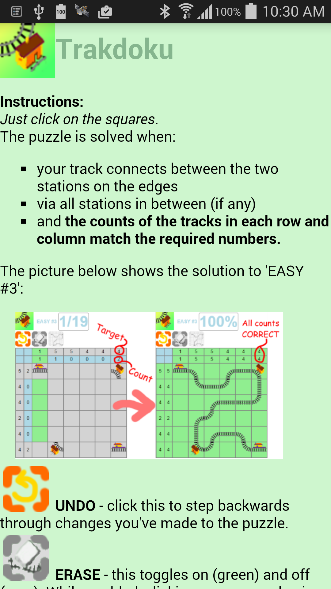

# trakdoku

Train Tracks puzzle game for Android (as an Android programming exercise).

This android app has a general application structure which could be broadly applicable.

The app has single full-screen display ViewPager UI element which allows swiping left & right between 'page'
display components, each of which is populated with a full-screen WebView UI element which can load local 
HTML and Javascript. An Andriod API is used to allow functions in JS to be called from the native (Java)
android code and vice versa. Examples of this is clicking an HTML link on one page can cause the ViewPager
outer application to scroll left or right, and completing a Trakdoku puzzle successfully results in the
web JS calling Android to update the accumulated score.

 
